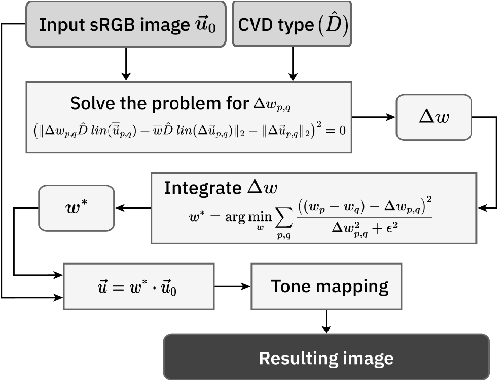
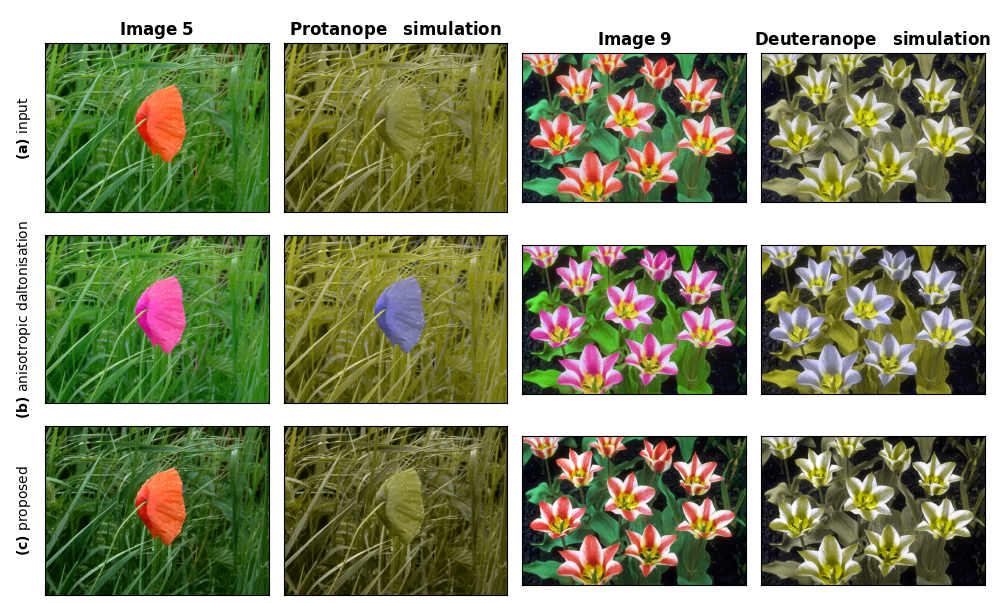

# Leveraging Achromatic Component for Trichromat-Friendly Daltonization
A Python implementation of the method proposed in
[*Leveraging Achromatic Component for Trichromat-Friendly Daltonization*](https://doi.org/10.3390/jimaging11070225),
published in *J. Imaging*, 2025.

**Authors of the original paper:**
- [Dmitry Sidorchuk](https://orcid.org/0000-0003-2873-9387)
- [Almir Nurmukhametov](https://orcid.org/0000-0003-3138-6965)
- [Paul Maximov](https://orcid.org/0000-0001-6332-0122)
- [Valentina Bozhkova](https://orcid.org/0000-0002-3319-1822)
- [Anastasia Sarycheva](https://orcid.org/0000-0002-0280-1157)
- [Maria Pavlova](https://orcid.org/0000-0002-5682-8160)
- [Anna Kazakova](https://orcid.org/0000-0002-5184-5316)
- [Maria Gracheva](https://orcid.org/0000-0003-0196-148X)
- [Dmitry Nikolaev](https://orcid.org/0000-0001-5560-7668)

## Method Overview

The figure below shows the full pipeline of the achromatic contrast-preserving daltonization method. The original image is first transformed using a color vision deficiency simulation. Then, a pixel-wise weight map is optimized to restore local contrast in the achromatic domain, followed by tone mapping to produce the final result.

The following diagram illustrates the proposed daltonization pipeline based on achromatic contrast optimization:



## Example Application

The method enhances local achromatic contrast perceived by color vision deficient observers while preserving the natural appearance for trichromats.
The image below illustrates the effect of the proposed method on a sample images.

Images 5 and 9 processed for protanopes and deuteranopes, respectively.
In rows: the original image, images derived using the anisotropic daltonization method, images obtained through the method proposed in our study. Displayed in columns: the image and its corresponding simulation.


<p><sub>Figure 8 from the original paper: application of the proposed method to a natural image.</sub></p>


## Usage

### Installation

Clone the repository and install with pip:

```bash
git clone https://github.com/iitpvisionlab/achromatic-daltonization.git
cd achromatic-daltonization
pip install -e .
```

### Configuration

This implementation uses a JSON configuration file to define input/output paths and optimization settings.
An example is shown below:

```json
{
    "loss": {
        "name": "reduced_problem_optimization",
        "pixel_bias": 1,
        "sign_guide": "l",
        "avg_ma": 0.8,
        "eps": 0.015
    },
    "optimizer": {
        "name": "Adam",
        "learning_rate": 0.0001
    },
    "simulation": {
        "name": "Vienot",
        "cvd_type": "protan"
    },
    "dataset_path": "path_to_dataset_dir",
    "batch_size": 21,
    "save_dir": "path_to_save_results",
    "epochs": 10000,
    "gap": 1e-8,
    "cuda": 0

}
```
Example configuration files:
- [`achro_dalt/config.json`](achro_dalt/config.json)

### Running
Run the script using:
```bash
python -m achro_dalt.run_optimize --config achro_dalt/config.json
```

# Citation

```bibtex
@Article{jimaging11070225,
AUTHOR = {Sidorchuk, Dmitry and Nurmukhametov, Almir and Maximov, Paul and Bozhkova, Valentina and Sarycheva, Anastasia and Pavlova, Maria and Kazakova, Anna and Gracheva, Maria and Nikolaev, Dmitry},
TITLE = {Leveraging Achromatic Component for Trichromat-Friendly Daltonization},
JOURNAL = {Journal of Imaging},
VOLUME = {11},
YEAR = {2025},
NUMBER = {7},
ARTICLE-NUMBER = {225},
URL = {https://www.mdpi.com/2313-433X/11/7/225},
PubMedID = {40710612},
ISSN = {2313-433X},
DOI = {10.3390/jimaging11070225}
}
```

# License
This project is licensed under the MIT License - see the LICENSE file for details.